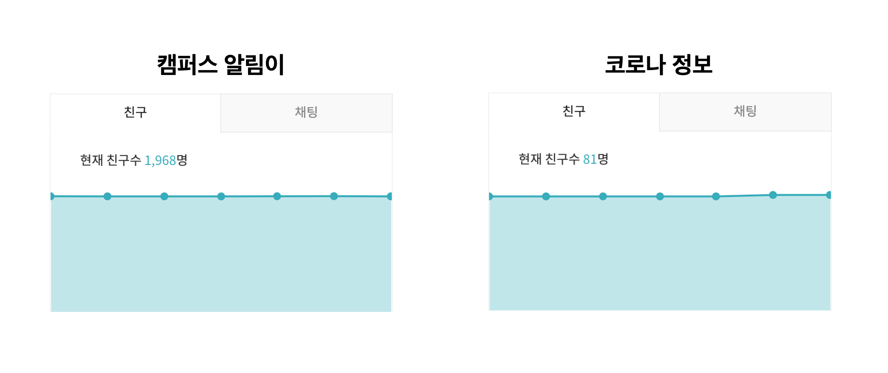
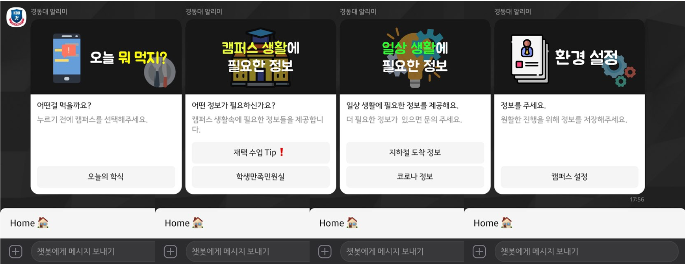
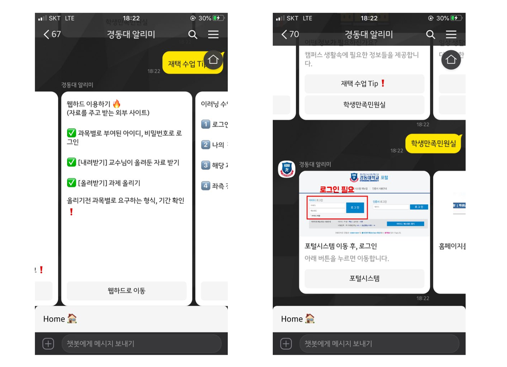
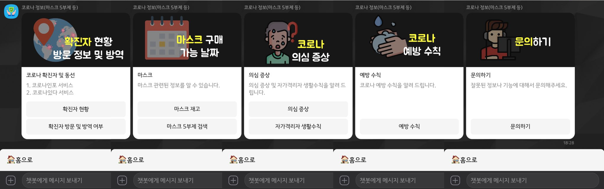
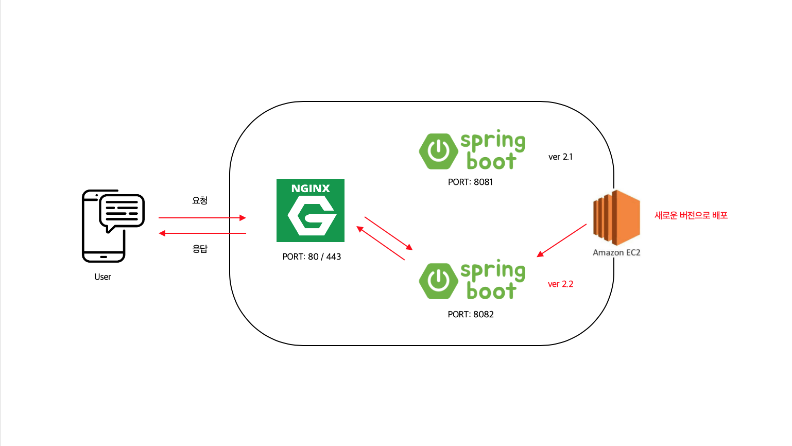
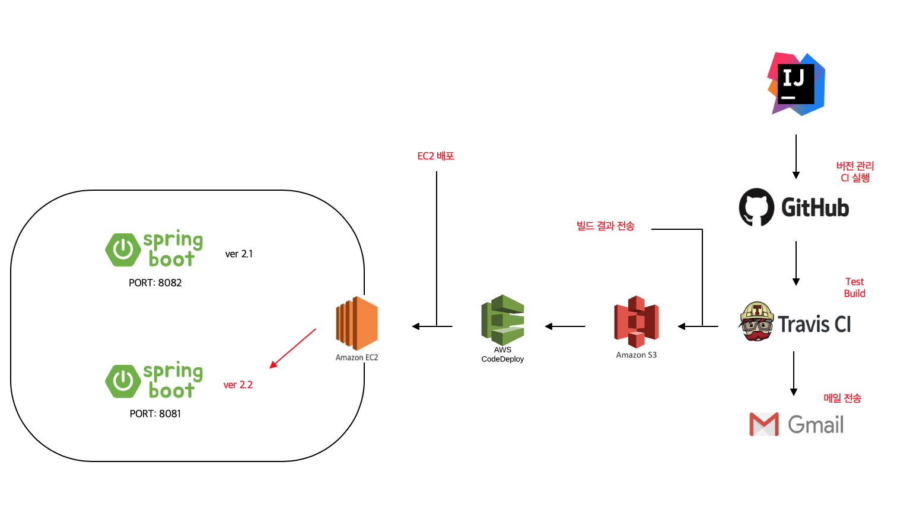

# 오픈빌더를 활용한 챗봇 서비스 



---

<br/><br/>

## 📜 목차
* [소개](https://github.com/hyojaekim/chatbot#-%EC%86%8C%EA%B0%9C)
* [기능](https://github.com/hyojaekim/chatbot#-%EA%B8%B0%EB%8A%A5)
* [구성](https://github.com/hyojaekim/chatbot#-%EA%B5%AC%EC%84%B1)
* [기술 스택](https://github.com/hyojaekim/chatbot#-%EA%B8%B0%EC%88%A0-%EC%8A%A4%ED%83%9D)
* [Wiki](https://github.com/hyojaekim/chatbot#wiki)
* [TODO](https://github.com/hyojaekim/chatbot#-todo)

<br/><br/>

## 🗣 소개

#### [🏫 KDU 알림이](https://pf.kakao.com/_hdxaVj)

캠퍼스 생활에 필요한 정보를 제공해주는 서비스 입니다.

#### [🦠 코로나 정보](https://pf.kakao.com/_hUrGxb)

코로나 관련된 정보를 제공하는 서비스 입니다.

<br/><br/>

## 🧩 기능

#### #1 캠퍼스 알림이

| 분류 | 기능 | 구현여부(Y/N) |
| :---: | :---: | :---: |
| KDU 알림이 | 학식 메뉴 | Y |
| | 캠퍼스 설정 | Y |
| | 지하철 도착 정보 | Y |
| | 학교 민원실 정보 | Y |
| | 재택 수업 Tip | Y |
| | 버스 시간표 | Y |
| | QR 코드 이벤트 | Y |
| | 중고 거래 | N |
| | 지하철역 즐겨찾기 | N |
| | 연락처 검색 (주변 가게 혹은 학교 전화번호) | N |
| | 날씨 | N |
| | 자주 사용하는 학교 홈페이지 | N |






#### #2 코로나 정보

| 분류 | 기능 | 구현여부(Y/N) |
| :---: | :---: | :---: |
| 코로나 정보 | 확진자 현황 및 동선 (해당 서비스로 이동) | Y |
| | 해당 장소 방역 여부 (해당 서비스로 이동) | Y |
| | 마스크 재고 | Y |
| | 마스크 5부제 (구매 가능한 날짜) | Y |
| | 예방 수칙 | Y |
| | 의심증상 | Y |




<br/><br/>

## 👉🏻 구성





<br/><br/>

## 🛠 기술 스택

```
Language : Kotlin

Backend : Spring Boot, JPA

Database : MariaDB

AWS : EC2, RDS, S3, CodeDeploy

CD/CI : Travis-CI
 
Source version control : GIT

Repository : GitHub

Issue Tracker : GitHub Issues, GitHub Kanban Board
```

<br/><br/>

## [Wiki](https://github.com/hyojaekim/chatbot/wiki)

- [DB 방언 문제](https://github.com/hyojaekim/chatbot/wiki/DB-%EB%B0%A9%EC%96%B8-%EB%AC%B8%EC%A0%9C-(MySQL5InnoDBDialect-Deprecated))
- [OSIV](https://github.com/hyojaekim/chatbot/wiki/OSIV-(Open-Session-In-View)-%EB%AC%B8%EC%A0%9C%EC%A0%90)
- [JSON 라이브러리 선택하기](https://github.com/hyojaekim/chatbot/wiki/JSON-%EB%9D%BC%EC%9D%B4%EB%B8%8C%EB%9F%AC%EB%A6%AC-%EC%84%A0%ED%83%9D-%EA%B8%B0%EC%A4%80)
- [크롤링을 위한 라이브러리 선택](https://github.com/hyojaekim/chatbot/wiki/%ED%81%AC%EB%A1%A4%EB%A7%81%EC%9D%84-%EC%9C%84%ED%95%9C-%EB%9D%BC%EC%9D%B4%EB%B8%8C%EB%9F%AC%EB%A6%AC-%EC%84%A0%EC%A0%95-(Jsoup))
- [지하철 정보](https://github.com/hyojaekim/chatbot/wiki/%EC%8B%A4%EC%8B%9C%EA%B0%84-%EC%A7%80%ED%95%98%EC%B2%A0-%EC%A0%95%EB%B3%B4)
- [마스크 재고 정보](https://github.com/hyojaekim/chatbot/wiki/%EB%A7%88%EC%8A%A4%ED%81%AC-%EC%9E%AC%EA%B3%A0-%EC%A0%95%EB%B3%B4-%EC%98%88%EC%8B%9C)
- [주소로 위도, 경도 알아내기](https://github.com/hyojaekim/chatbot/wiki/%EC%A3%BC%EC%86%8C-%EC%9C%84%EB%8F%84,-%EA%B2%BD%EB%8F%84-%EC%95%8C%EC%95%84%EB%82%B4%EA%B8%B0)
- [중요한 키값 관리하기](https://hyojaedev.tistory.com/13)
- [시리로 배포하기](https://hyojaedev.tistory.com/15)

<br/><br/>

## ✅ TODO

- [x] 무중단 배포
- [x] CI/CD 구축
- [x] 캠퍼스 설정
- [x] 학식 메뉴 크롤링하여 저장
- [x] 캠퍼스에 맞는 각 식당의 학식 메뉴 가져오기
- [x] 학교 민원실 이동 안내
- [x] 실시간 지하철 도착 정보
- [x] 재택 수업 Tip
- [x] 마스크 5부제 (구매 가능한 요일)
- [x] 주소로 위도와 경도 찾기
- [x] 반경 2km 마스크 재고
- [x] Siri로 배포하기
- [x] QR코드를 활용한 이벤트
- [ ] 중고 거래
  - [ ] 게시글 작성(제목, 내용, 오픈 채팅 링크)
  - [ ] 게시글 조회
  - [ ] 게시글 삭제
- [ ] 지하철 도착 정보 즐겨찾기
  - [ ] 즐겨찾기 추가
  - [ ] 즐겨찾기 삭제
  - [ ] 즐겨찾기 버튼 조회
- [ ] 미세먼지 및 날씨