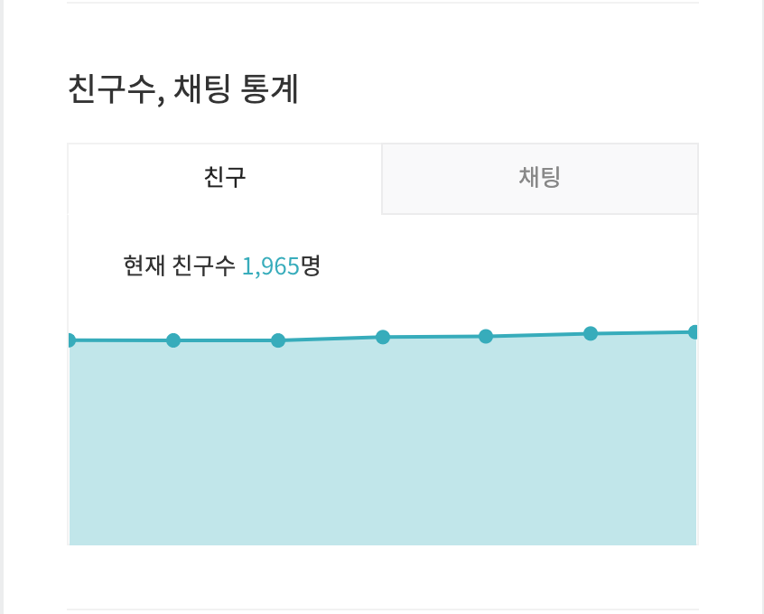
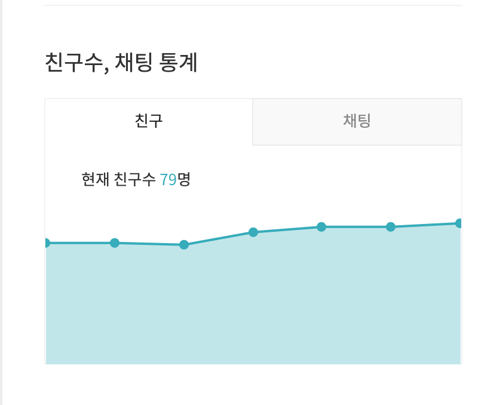

# 오픈빌더를 활용한 챗봇 서비스 

### [KDU 알림이](https://pf.kakao.com/_hdxaVj)

캠퍼스 생활에 필요한 정보를 제공해주는 서비스 입니다.

(20.04.08 기준)



### [코로나 정보](https://pf.kakao.com/_hUrGxb)

코로나 관련된 정보를 제공하는 서비스 입니다.

(20.04.08 기준)



# 기능

### #1 캠퍼스 알림이

| 분류 | 기능 | 구현여부(Y/N) |
| :---: | :---: | :---: |
| KDU 알림이 | 학식 메뉴 | Y |
| | 캠퍼스 설정 | Y |
| | 지하철 도착 정보 | Y |
| | 학교 민원실 정보 | Y |
| | 재택 수업 Tip | Y |
| | 연락처 검색 (주변 가게 혹은 학교 전화번호) | N |
| | 날씨 | N |
| | 자주 사용하는 학교 홈페이지 | N |


### #2 코로나 정보

| 분류 | 기능 | 구현여부(Y/N) |
| :---: | :---: | :---: |
| 코로나 정보 | 확진자 현황 및 동선 (해당 서비스로 이동) | Y |
| | 해당 장소 방역 여부 (해당 서비스로 이동) | Y |
| | 마스크 재고 (해당 서비스로 이동) | Y |
| | 마스크 5부제 (구매 가능한 날짜) | Y |
| | 예방 수칙 | Y |
| | 의심증상 | Y |
| | 마스크 재고 (직접 개발) | N |


---

### 흐름


### 기술 스택

```
Language : Kotlin

Backend : Spring Boot, JPA

Database : MariaDB

AWS : EC2, RDS, S3, CodeDeploy

CD/CI : Travis-CI
 
Source version control : GIT

Repository : GitHub

Issue Tracker : GitHub Issues, GitHub Kanban Board
```

